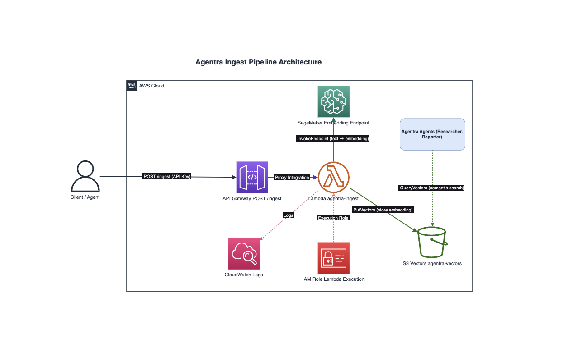

# Ingest Pipeline Infrastructure

This Terraform module deploys the infrastructure for Agentra's document ingestion pipeline — an API-backed Lambda function that converts text into vector embeddings and stores them in S3 Vectors.

## What It Deploys

| Resource | Description |
|---|---|
| **S3 Bucket** | Vector store bucket (`agentra-vectors-{account_id}`) with versioning, AES256 encryption, and public access blocked |
| **IAM Role + Policy** | Lambda execution role with permissions for CloudWatch Logs, S3, SageMaker invocation, and S3 Vectors operations |
| **Lambda Function** | Deploys `lambda_function.zip` from `backend/ingest/` — 512 MB memory, 60s timeout, Python 3.12 |
| **API Gateway (REST)** | Regional REST API with `POST /ingest` endpoint, API key auth, and Lambda proxy integration |
| **API Key + Usage Plan** | API key with a usage plan: 10,000 requests/month, 100 req/s rate, 200 burst |
| **CloudWatch Log Group** | Lambda log group with 7-day retention |

## Architecture Diagram



> Source: [`ingest-architecture.drawio`](./ingest-architecture.drawio)

## How It Fits Into Agentra

This module sits between the SageMaker endpoint (`1_sagemaker`) and the agent layer. It provides the public API for pushing documents into the vector store and is the write path for all financial data that agents later query.

```
Client → API Gateway (POST /ingest) → Lambda → SageMaker Endpoint (1_sagemaker)
                                         ↓
                                    S3 Vectors Bucket
                                         ↓
                                  Agents query vectors
```

## Dependencies

- **`terraform/1_sagemaker`** must be deployed first — this module references the SageMaker endpoint name
- **`backend/ingest/lambda_function.zip`** must be built before applying — run `python package.py` in `backend/ingest/`

## Configuration

| Variable | Description | Default |
|---|---|---|
| `aws_region` | AWS region for all resources | — (required) |
| `sagemaker_endpoint_name` | Name of the SageMaker endpoint from `1_sagemaker` | — (required) |

Example `terraform.tfvars`:

```hcl
aws_region              = "us-east-1"
sagemaker_endpoint_name = "agentra-embedding-endpoint"
```

## Outputs

| Output | Description |
|---|---|
| `vector_bucket_name` | Name of the S3 Vectors bucket |
| `api_endpoint` | Full URL for the `POST /ingest` endpoint |
| `api_key_id` | API Gateway API key ID |
| `api_key_value` | API key value (sensitive — use AWS CLI to retrieve) |
| `setup_instructions` | Post-deploy instructions for `.env` setup and testing |

## Usage

```bash
# Build the Lambda package first
cd ../../backend/ingest
python package.py
cd ../../terraform/2_ingest

# Initialize and deploy
terraform init
terraform plan
terraform apply

# Retrieve the API key
aws apigateway get-api-key --api-key <api_key_id> --include-value --query 'value' --output text

# Test the endpoint
curl -X POST <api_endpoint> \
  -H "x-api-key: <your-api-key>" \
  -H "Content-Type: application/json" \
  -d '{"text": "Test document", "metadata": {"source": "test"}}'
```

## References

- [S3 Vectors Documentation](https://docs.aws.amazon.com/AmazonS3/latest/userguide/s3-vectors.html)
- [API Gateway REST API](https://docs.aws.amazon.com/apigateway/latest/developerguide/apigateway-rest-api.html)
- [Lambda Deployment Packages](https://docs.aws.amazon.com/lambda/latest/dg/python-package.html)
