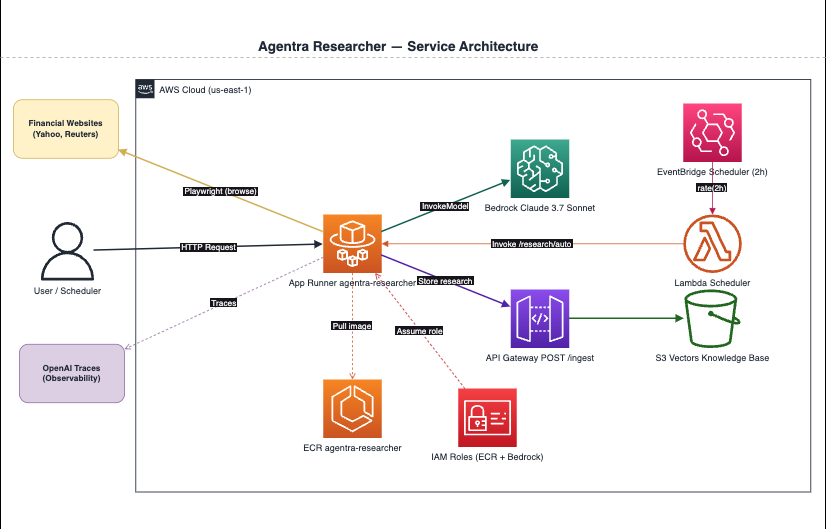

# Researcher Service Infrastructure

This Terraform module deploys the infrastructure for the Agentra Researcher agent — an App Runner service that runs autonomous investment research using Bedrock and Playwright.

## What It Deploys

| Resource | Description |
|---|---|
| **ECR Repository** | `agentra-researcher` — stores Docker images for the researcher service |
| **App Runner Service** | Runs the FastAPI researcher container (1 vCPU, 2 GB memory) |
| **IAM Role (App Runner)** | Access role for pulling images from ECR |
| **IAM Role (Instance)** | Runtime role with Bedrock `InvokeModel` permissions |
| **EventBridge Schedule** | (optional) Triggers automated research every 2 hours |
| **Scheduler Lambda** | (optional) Invokes the App Runner `/research/auto` endpoint on schedule |

## Architecture Diagram



> Source: [`researcher-architecture.drawio`](./researcher-architecture.drawio)

## How It Fits Into Agentra

This module deploys the Researcher agent, which feeds the knowledge base with current market intelligence. It depends on the ingest pipeline (`2_ingest`) for storing findings and the SageMaker endpoint (`1_sagemaker`) for embedding them.

```
EventBridge (every 2h) → Lambda → App Runner (Researcher)
                                       ├── Playwright → Financial websites
                                       ├── Bedrock → Claude 3.7 Sonnet
                                       └── Ingest API → S3 Vectors
```

## Dependencies

- **`terraform/1_sagemaker`** — SageMaker embedding endpoint (used by the ingest pipeline)
- **`terraform/2_ingest`** — Ingest API endpoint and API key (passed as env vars to App Runner)
- **Docker image** — must be built and pushed to ECR before the App Runner service can start

## Configuration

| Variable | Description | Default |
|---|---|---|
| `aws_region` | AWS region | — (required) |
| `aws_profile` | AWS CLI profile | `"default"` |
| `openai_api_key` | OpenAI API key for agent tracing | — (required) |
| `agentra_api_endpoint` | Ingest API URL from `2_ingest` | — (required) |
| `agentra_api_key` | Ingest API key from `2_ingest` | — (required) |
| `scheduler_enabled` | Enable automated research every 2 hours | `false` |

## Outputs

| Output | Description |
|---|---|
| `ecr_repository_url` | ECR repository URL for Docker pushes |
| `app_runner_service_url` | Public URL of the researcher service |
| `app_runner_service_id` | App Runner service ID |
| `scheduler_status` | Whether the automated scheduler is enabled |

## Deployment Workflow

```bash
# 1. Deploy infrastructure (creates ECR repo + App Runner shell)
terraform init
terraform apply

# 2. Build and push Docker image from backend/researcher
cd ../../backend/researcher
uv run deploy.py

# 3. Verify
curl https://<service-url>/health
```

## Enabling the Scheduler

To enable automated research runs every 2 hours:

```hcl
scheduler_enabled = true
```

This creates an EventBridge schedule → Lambda → App Runner chain. The Lambda must be built first:

```bash
cd ../../backend/scheduler
python package.py
```

Then re-run `terraform apply`.
